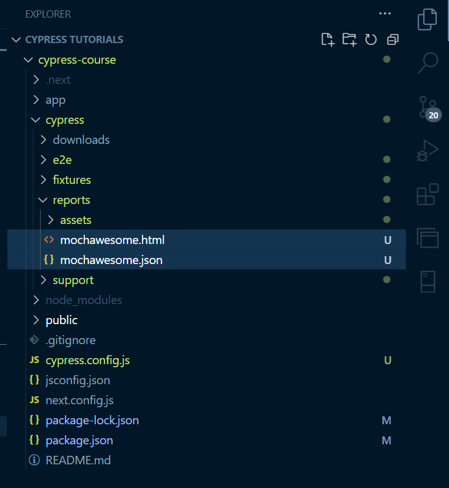

# CYPRESS OUTPUT FORMATS INTO DATABRICKS.

## Exporting Cypress Test Results to CSV
- Cypress doesn’t natively support CSV, but you can use a custom Mocha reporter like mocha-reporter-csv to achieve this.

## Resources for JSON and HTML
Mochawesome https://cytesting.github.io/cypress/2020/11/21/reporting-with-cypress-and-mochawesome.html

The code below is set up inside the `cypress.config.js`
```
const { defineConfig } = require("cypress");

module.exports = defineConfig({
  reporter: 'mochawesome',
  reporterOptions: {
    reportDir: 'cypress/reports', // Directory where the report will be saved
    overwrite: false,
    html: true,
    json: true,
  },
  e2e: {
    setupNodeEvents(on, config) {
      // implement node event listeners here
    },
  },
});
```
After running these tests, you can merge the JSON reports using the `mochawesome-merge`:

`npx mochawesome-merge cypress/reports/*.json > combined-report.json`

Also you can generate a single HTML report using `mochawesome-report-generator`

`npx marge combined-report.json -f report -o ./cypress/reports`

An example of the outputs in html and json are as  shown in the image snip below.



Here are the pros and cons of using reporters like mochawesome in Cypress for generating reports:

## Pros
### 1. Detailed Reports
Visual HTML Reports: Reporters like mochawesome provide visually appealing, detailed HTML reports, including passed/failed/skipped tests, time duration, error stack traces, and screenshots.
JSON Reports: The test results can also be exported as JSON, making them useful for further processing, analysis, or integration with other systems.
### 2. Easy to Share
Standalone HTML Reports: The generated HTML reports are standalone, meaning they can easily be shared with team members or stored for future reference without requiring special tools to view.
### 3. Customizable
Custom Reporter Options: Reporters like mochawesome allow customization (e.g., report location, whether to include screenshots, display hierarchy, etc.), making it easier to integrate into various CI/CD pipelines and reporting needs.
### 4. Supports CI Integration
Continuous Integration (CI) Friendly: The reports are compatible with most CI platforms, and you can integrate them to get test results directly from your pipelines (e.g., Jenkins, GitLab CI, CircleCI).
### 5. Combining Reports
Multiple Test Runs: You can merge multiple reports into one consolidated report, which is useful for parallel test executions or when running tests across different browsers or environments.
### 6. Error Tracing
Detailed Error Reporting: Provides stack traces, which helps you trace down the cause of test failures quickly and understand where things went wrong.

## Cons
### 1. Setup Overhead
Extra Configuration: You need to install and configure additional packages (mochawesome, mochawesome-merge, mochawesome-report-generator) and set up appropriate report directories. For small teams or projects, this might seem unnecessary.
### 2. Slower Test Execution
Slower Test Runs: Depending on the size of your test suite, generating and writing reports can slightly slow down the test execution, especially when generating detailed reports with screenshots.
### 3. Large Report Size
Report Size: The generated HTML files, especially if they include screenshots, can become large. This can become problematic when storing them in version control or transferring them across systems.
### 4. Maintaining Additional Dependencies
Dependency Management: By introducing additional packages like mochawesome, you're increasing the number of dependencies your project relies on, which may require maintenance over time (e.g., upgrading versions, resolving conflicts).
### 5. Limited Built-in Customization for Some Reporters
Limited Customization: While mochawesome is customizable, not all reporters provide deep customization for certain complex reporting needs (e.g., custom formatting, integrating with proprietary test management systems). You might need additional plugins or post-processing scripts for more advanced use cases.
### 6. Not Ideal for Real-time Results
Post-Test Reporting: These reports are generated after all tests finish running. If you want real-time reporting (i.e., seeing test results live while tests are still running), you may need additional tools or configurations.


## JUnit for XML
- JUnit Reporter https://docs.cypress.io/app/tooling/reporters

## HTML
- Mochawesome https://cytesting.github.io/cypress/2020/11/21/reporting-with-cypress-and-mochawesome.html

## JSON/HTML
- Allure Report https://allurereport.org/docs/

## Multiple exports
- Cypress multireporters.

## Built in reporters
- spec reporter
- 3rd party reporters for Mocha
    - teamCity
    - junit

## Custom reporters
- custom Mocha reporters

# Meetings reports 
### CFA
- Manual cypress tests from github. This saves on time and costs. Manual trigger workflow.
- Tests triggered using github workflows.
This github workflow will create a docker image for the cypress test and save it on ECR instance on AWS.
They fire up an ec2 instance still in AWS which runs docker image and results stored in an s3 bucket as html/json.
- Its possible to trigger an automated testing on Github actions.

#### Theories came up with.
Python scripts in databricks - notepads, that will purpose to do the job.
We can use ECR or Docker hub since it saves the image created.

### Cypress
- It is possible to convert a json file to a csv file using a PySpark on Databricks notebooks.